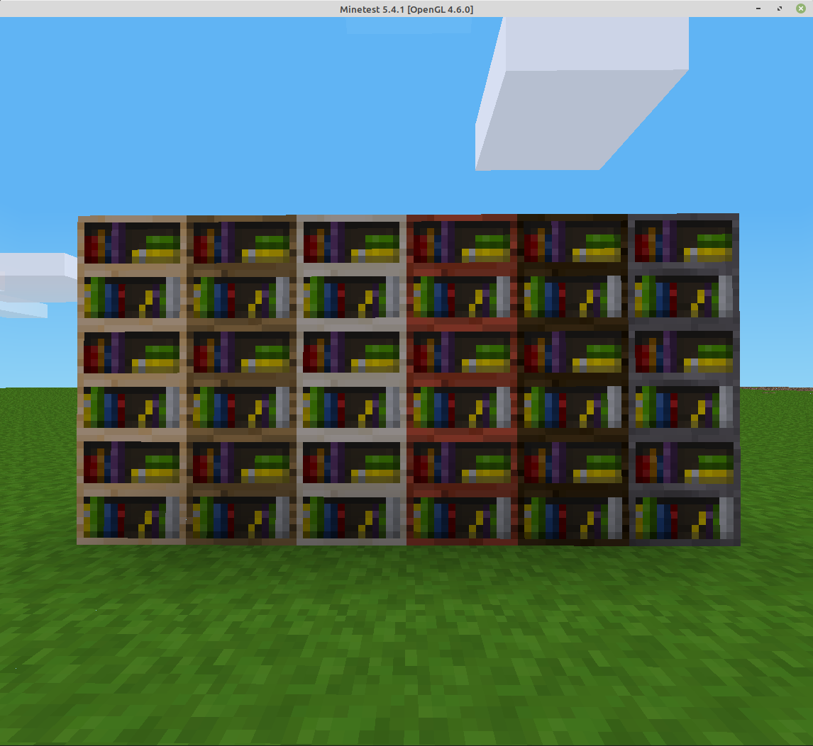

===========
decoshelves
===========

This is a mod for `Minetest <https://www.minetest.net/>`__, providing an expanded selection of bookshelves.

Have YOU ever wanted to make a bookshelf out of leaves, coral, lava or any other completely unrealistic material? Well, now you can!

`minetest-game <https://github.com/minetest/minetest_game/>`__ provides a single bookshelf made out of default wood.

This mod provides (as standard) bookshelves made out of forty additional materials.

You can easily add or remove bookshelves; just open the init.lua file in a text editor, and add or remove lines from the list. You can create a bookshelf out of (almost) any material: as long as minetest can retrieve the texture, than decoshelves can use that texture.

License (code): GNU Lesser General Public License, version 2.1
License (media): Attribution-ShareAlike 3.0 Unported (CC BY-SA 3.0)

Credits: The code and textures are adapted from `minetest-game <https://github.com/minetest/minetest_game/>`__.

Dependencies: default
Optional dependencies: bones and bucket
